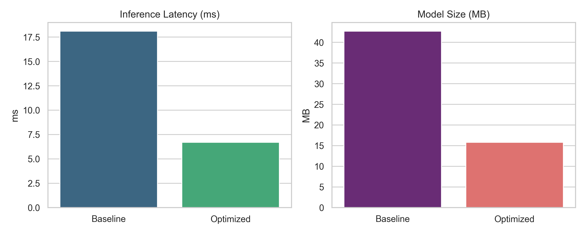

# ⚡ EcoEdge AI: Dynamic Neural Network Optimization Framework

**EcoEdge AI** is a lightweight, end-to-end framework designed to optimize deep learning models for deployment on resource-constrained **Edge devices**.

By combining **structural pruning**, **INT8 quantization**, and **knowledge distillation**, EcoEdge AI drastically reduces **memory footprint**, **latency**, and **power consumption** without sacrificing inference accuracy.

---

## 🚀 Key Features

### Dynamic Pruning Engine

Automatically removes redundant weights using **structured magnitude-based pruning**.

### Quantization Pipeline

Converts **FP32 models to INT8 / Bfloat16**, optimizing execution for microcontrollers and low-power CPUs.

### Automated Benchmarking

Measures:

* Real-time latency (ms)
* Peak RAM usage (MB)
* Compression ratio
* Accuracy trade-offs

### Modular & Extensible

Clean Python architecture easily adaptable to:

* Vision models
* Audio models
* IoT tabular models

---

## 📁 Repository Structure

```text
ecoedge-ai/
├── configs/            # Configuration files (YAML)
├── ecoedge/            # Core framework package
│   ├── compression/    # Pruning, Quantization, Distillation modules
│   ├── core/           # Trainer & Helper utilities
│   ├── export/         # ONNX Exporter
│   └── profiling/      # Latency, Memory, and Energy trackers
├── scripts/            # Training and benchmarking entrypoints
└── tests/              # Unit test suite
```
---

## 📊 Performance & Benchmark Results

EcoEdge AI drastically reduces edge model footprints and inference times using dynamic INT8 quantization and structured pruning.



### Key Metrics Summary

| Metric | Baseline (FP32) | EcoEdge AI (Optimized) | Improvement |
| :--- | :--- | :--- | :--- |
| **Inference Latency** | 18.10 ms | **6.70 ms** | **+63% Speedup** |
| **Model File Size** | 42.69 MB | **15.79 MB** | **-63% Memory** |
| **Execution Target** | CPU Baseline | CPU Edge Optimized | High Efficiency |

---

## 🛠️ Quickstart

### 1. Installation

```bash
git clone https://github.com/RafiKhelalfa/EcoEdge-AI.git
cd EcoEdge-AI

python -m venv venv
.\venv\Scripts\activate

pip install -r requirements.txt
pip install -e .
```

### 2. Train Baseline Model

```bash
python scripts/train_baseline.py
```

### 3. Run Optimization & Benchmarking

```bash
python scripts/run_benchmark.py
```

### 4. Run Unit Tests

```bash
python -m unittest discover tests
```
---

## 📊 Benchmarking Output

Running `scripts/run_benchmark.py` automatically generates a visual performance comparison saved as:

```text
benchmark_results.png
```

The benchmark details:

* **Inference Latency Reduction (ms)**
* **Model Size Compression (MB)**

---

## 📜 License

Distributed under the **MIT License**.

See [`LICENSE`](LICENSE) for more information.
